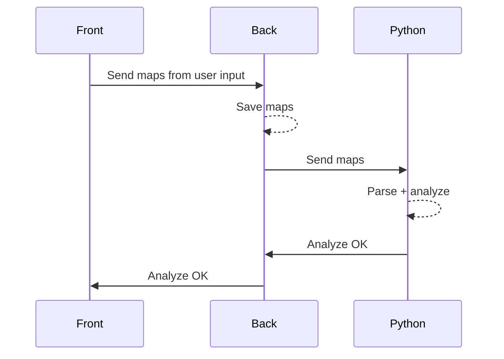

# General
Here's the general architecture of the project.

## 🗓️ Tracker
Tracking stuff.

## 🔎 Scouting
We use OverFast API built by TeKrop.

## 📊 Analysis
Analyse from log files generated by the scrim workshop code : `...`

## 👥 Teams

### Creation
Creation of a team

### Join
Join a team

### Admin
:::warning
TODO : need to create team admins / user roles to kick / change code / etc.
:::