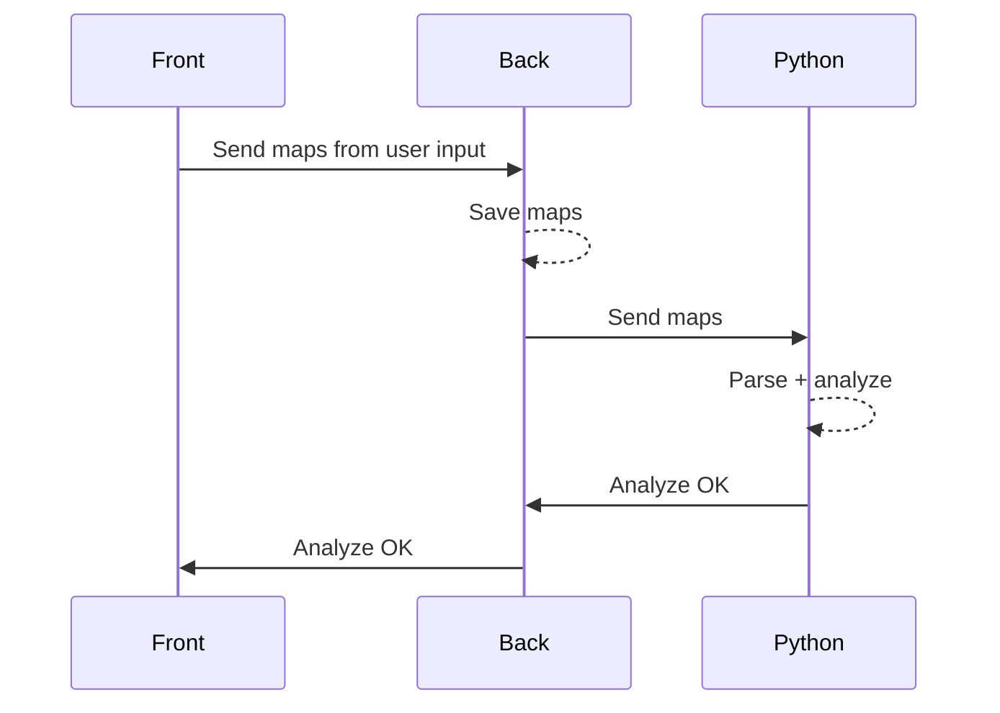

# Architecture
Here's the general architecture of the project.

## 🗓️ Tracker
The tracking feature is a classic form input. Once the form is filled, it is sent to the backend and stored in the `tracker_results` table. All the stats and charts are client-side generated and updated in real-time.

## 📊 Analysis
Analyse from log files generated by the scrim workshop code : `DKEEH` from [Scrimtime](https://workshop.codes/DKEEH).
Once imported, the files are parsed and analyzed to provide a better understanding of the game. Here's a sequence diagram of the process :

The `.txt` files are sent to the backend, then to the Python processing server. Once the analysis is done, the backend sends the alert to the frontend via websockets so the user doesn't have to refresh the page.

## 🔎 Scouting

### 🥊 FACEIT

### ❄️ Blizzard

## 👥 Teams
