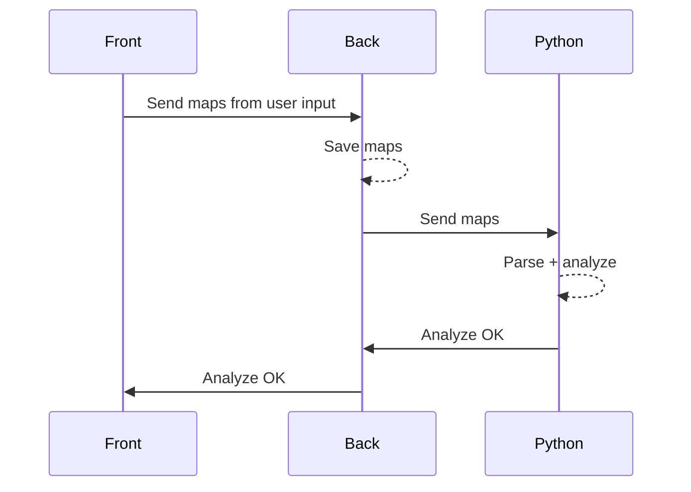

# Architecture
The general architecture of the project.
:::info
This is still in progress and we're working on it.
::: 

## 🗓️ Tracker
The tracking feature is a classic form input. Once the form is filled, it is sent to the backend and stored in the `tracker_results` table. All the stats and charts are client-side generated and updated in real-time.

## 📊 Analysis
Analyse from log files generated by the scrim workshop code : `DKEEH` from [Scrimtime](https://workshop.codes/DKEEH).
Once imported, the files are parsed and analyzed to provide a better understanding of the game. Here's a sequence diagram of the process :

The `.txt` files are sent to the backend, then to the Python processing server. Once the analysis is done, the backend sends the alert to the frontend via websockets so the user doesn't have to refresh the page.

## 🔎 Scouting
Our scouting part is dedicated to fetch players, teams, matches information. For that, we have 2 main sources : `FACEIT` and `Blizzard`.

Our frontend calls are made with `Tanstack Query` so we have a nice cache system and we don't have to worry about the data fetching.
### 🥊 FACEIT
We use [FACEIT API](https://developers.faceit.com/) to fetch data from the platform. We are able to get players, teams, and matches information. 
:::warning
Some of the data provided by FACEIT seems not to be accurate (results in player history for example), so we have to be careful with the data we get from them.
:::
### ❄️ Blizzard
To fetch data from Blizzard, we use the [OverFast API](https://overfast-api.tekrop.fr/) provided by [TeKrop](https://github.com/TeKrop).

Blizzard let us get some players information that have a **public career**. When the data is available we can get stats about the players and its heroes, but also about the winrate and the number of games played on the different roles. I recommend to check out the [OverFast documentation](https://overfast-api.tekrop.fr/) which is really well done.

## 👥 Teams
Teams are a way to group players together. Nohting complicated behind it : a user can create a team or join a team. 

If a user create a team, he's automatically considered as `ADMIN`. An `ADMIN` can manage its team. Therefore, he can promote other players to `ADMIN` or `KICK` them from the team.